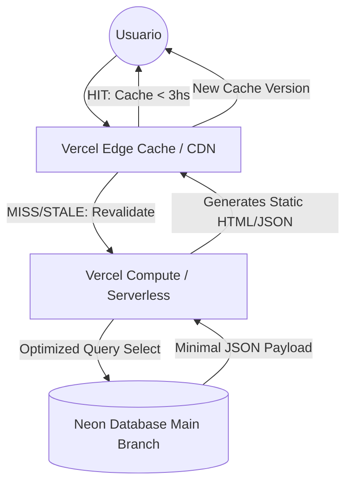

# Plan de Optimización Crítica - BringShop

Este plan tiene como objetivo reducir drásticamente el consumo de 'Fast Origin Transfer' en Vercel y 'Network Transfer' en Neon, moviendo la carga del servidor (Edge Runtime/Functions) a la caché de Vercel (Edge Network) mediante ISR y optimizando la transferencia de datos.

## 1. Migración a ISR (Incremental Static Regeneration)

Se eliminará `export const dynamic = 'force-dynamic'` de las rutas críticas y se reemplazará por `revalidate`.

### Rutas a Modificar:
- [`src/app/(client)/page.tsx`](src/app/(client)/page.tsx)
- [`src/app/(client)/productos/page.tsx`](src/app/(client)/productos/page.tsx)
- [`src/app/(client)/promociones/page.tsx`](src/app/(client)/promociones/page.tsx)

**Configuración Sugerida:** `revalidate = 10800` (3 horas).
*Esto significa que Vercel servirá una versión estática desde su CDN y solo consultará a Neon una vez cada 3 horas por ruta.*

## 2. Optimización de Consultas Prisma

Actualmente se está recuperando el objeto `Product` completo. Se implementará `select` para traer solo lo necesario para la UI.

### Campos Requeridos para `ClientProducts`:
- `id`
- `name`
- `price`
- `imageUrl`
- `category`
- `brand`
- `isPromo`
- `oldPrice`
- `inStock`
- `isFeatured`
- `isNewArrival`

*Esto reducirá el tamaño del payload JSON entre Neon y Vercel significativamente.*

## 3. Optimización de Imágenes

- Se reemplazará el uso de etiquetas `` por el componente `next/image` en `ClientProducts.tsx` y `HomeCarousel.tsx`.
- Se configurará `unoptimized: false` (por defecto) y se asegurará el cacheo correcto.
- Se añadirán los dominios necesarios en `next.config.ts`.

## 4. Gestión de Conexiones a Base de Datos

- Se revisará `src/lib/prisma.ts` para asegurar que el Pool de `pg` se maneje correctamente en entornos serverless, evitando fugas de conexiones que agoten los recursos de Neon.

---

## Todo List Detallado

- [ ] **Fase 1: Preparación**
    - [ ] Respaldar archivos actuales.
    - [ ] Identificar todos los `` que necesitan migración a `next/image`.

- [ ] **Fase 2: Implementación de ISR y Data Select**
    - [ ] Modificar `src/app/(client)/page.tsx`:
        - Cambiar `dynamic = 'force-dynamic'` por `revalidate = 10800`.
        - Aplicar `select` en las consultas de `slides`, `featuredProducts` y `newArrivals`.
    - [ ] Modificar `src/app/(client)/productos/page.tsx`:
        - Cambiar `dynamic = 'force-dynamic'` por `revalidate = 10800`.
        - Aplicar `select` en la consulta de `products`.
    - [ ] Modificar `src/app/(client)/promociones/page.tsx`:
        - Cambiar `dynamic = 'force-dynamic'` por `revalidate = 10800`.
        - Aplicar `select` en la consulta de `products`.

- [ ] **Fase 3: Optimización de Imágenes (Frontend)**
    - [ ] Actualizar `next.config.ts` con los dominios de imágenes (ej. Cloudinary, S3, etc.).
    - [ ] Refactorizar `src/app/(client)/ClientProducts.tsx` para usar `next/image`.
    - [ ] Refactorizar `src/app/(client)/HomeCarousel.tsx` para usar `next/image`.

- [ ] **Fase 4: Verificación de Infraestructura**
    - [ ] Asegurar que `DATABASE_URL` apunte a la rama `main` en Neon.
    - [ ] Validar que el singleton de Prisma no esté creando múltiples pools innecesarios.

## Diagrama de Flujo (Post-Optimización)

